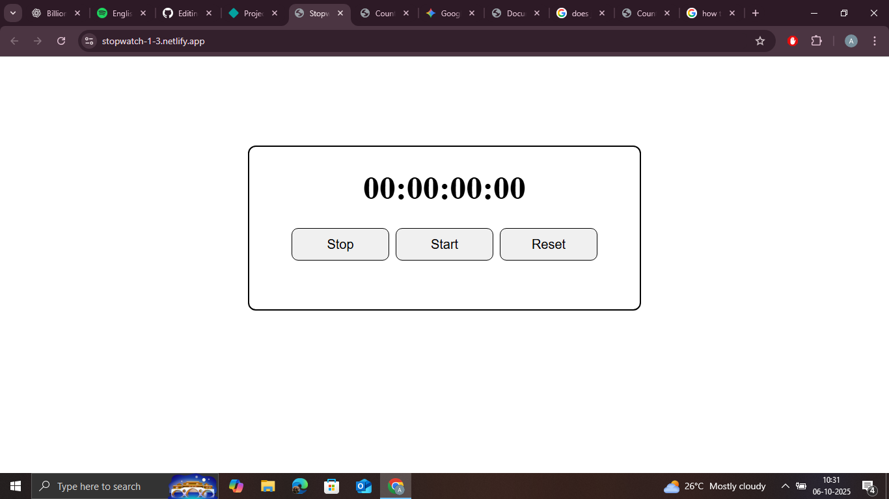

# ⏱️ Stopwatch App

A simple **Stopwatch Web App** built with HTML, CSS, and JavaScript.  
It allows users to start, stop, and reset the timer with millisecond accuracy.

## ⚙️ Features
- Start, Stop, and Reset buttons  
- Accurate time tracking using JavaScript  
- Responsive and lightweight design  

## 🧰 Tech Stack
- HTML  
- CSS  
- JavaScript  

## 🚀 Live Demo
[👉 View on Netlify](https://stopwatch-1-3.netlify.app/)

## 📸 Screenshot

